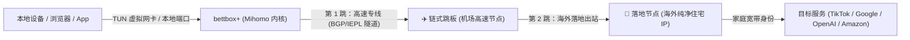

  <strong>简体中文</strong> | <a href="README_en.md">English</a>

<h1 align="center">⚡ bettbox+ (Bettbox Plus)</h1>

  <strong>Next-Generation Multi-Platform Proxy Client with Native Chain Proxy & Residential IP Engine</strong> 
  <strong>基于 Bettbox 深度重构，内置强大链式代理与静态住宅 IP 引擎的高性能跨平台网络客户端</strong>

  
  
  

  

---

## 📖 项目简介

**bettbox+** 是一款使用 **Mihomo (Clash Meta)** 深度定制内核、基于优秀开源项目 **[Bettbox](https://github.com/appshubcc/Bettbox)** 深度重构的高性能、多平台代理与规则分流客户端。

针对跨境出海、跨国社媒运营（TikTok / Instagram / Facebook / WhatsApp / X）、海外电商防关联（Amazon / eBay / Shopee）、AI 生产力（ChatGPT / Claude / Gemini / Midjourney）以及高要求网络隐私用户的核心痛点，bettbox+ 在继承原版轻量低耗、高帧流畅、界面精致的基础上，**独创研发了开箱即用的「链式代理（Chain Proxy）与静态住宅 IP 引擎」**，彻底打通“高速机场跳板”与“纯净海外家庭宽带”两跳链路，实现低延迟、高纯净度的跨境养号与高速冲浪环境。

---

### ✈️ 官方 Telegram 频道与社区交流

欢迎关注官方频道获取最新版本动态、网络规则与使用技巧：

👉 **官方 Telegram 频道**: [https://t.me/bettboxplus](https://t.me/bettboxplus)

---

## 🌟 核心特色功能：链式代理 (Chain Proxy) 与住宅 IP 引擎

链式代理（Proxy Chaining / 多跳代理）是 bettbox+ 最具代表性的核心创新功能。

### 为什么需要链式代理？
- **普通机场节点的痛点**：机房数据中心 IP（Datacenter IP），极易被目标平台标记为机器人或封禁风控。
- **直连住宅 IP 的痛点**：海外住宅 IP 通常位于海外当地，国内直接连接高丢包、高延迟甚至无法连通。
- **bettbox+ 链式代理的完美结合**：国内至跳板节点使用机场高速大带宽隧道，由跳板节点直接在海外就近连接海外住宅 IP 出口。既享有机场专线的高速稳定，又享有住宅宽带 100% 纯净度！

### 链式代理六大技术亮点：
1. **智能格式混贴一键导入**：
   - 支持主流代理供应商格式：`IP:Port:User:Pass`、`User:Pass@IP:Port`、免密白名单 `IP:Port`。
   - 支持标准 URI 格式：`socks5://`、`http://`、`ss://`、`trojan://`、`vless://`、`vmess://`，支持 `#` 标签自定义节点备注。
   - 支持多行混贴、自动过滤空行与 `#` / `//` 注释行，批量添加一气呵成。
2. **专职隔离跳板池（杜绝回环死锁）**：
   - 自动在内核配置中生成专职 `✈️ 链式跳板` 策略组，严格隔离原始出站节点与落地代理。
   - 自动过滤非真实节点（剩余流量、通知、到期提示等信息节点），首推真实节点作为前置跳板。
   - 绝不发生递归引用（Self-referencing Loop），确保代理链坚如磐石。
3. **WebRTC 真实 IP 泄露严格防御**：
   - 内置 WebRTC 隐匿防护机制，自动在规则层注入 STUN/TURN 协议拦截（端口 3478、19302 等及常见 STUN 域名）。
   - 有效杜绝网页端 JavaScript 通过 WebRTC 探测本地真实公网/内网 IP，保护真实身份不泄露。
4. **吞吐量与连接并发深度优化**：
   - 针对两跳网络特性，强制优化内核网络协议栈参数：自动开启 `tcp-concurrent`、`unified-delay`、Keep-Alive 连接保活。
   - 针对 HTTP TLS 落地代理自动协商 ALPN `[h2, http/1.1]`，充分发挥高并发大带宽优势。
5. **双模智能适配与 DNS 环路防死锁**：
   - 无论是「规则模式」还是「全局模式」，链式代理均能完美秒速生效。
   - 注入专有引导 DNS 解析与 `fake-ip-filter`，彻底防止跳板与落地代理因 DNS 解析死锁而断网。
6. **多目标服务独立健康体检**：
   - 内置 Cloudflare、OpenAI、TikTok、YouTube 等多个核心服务独立探测，毫秒级反馈延迟与可用性。

---

## 🚀 继承与发扬的原版核心特性

* **前台高帧、后台低耗**：继承 Bettbox 优秀的 UI 架构，打磨每处动画交互细节，前台高刷新率，后台极度省电。
* **双端开箱即用**：全平台稳定的权限处理，舒适的 TUN 模式与 VPN 虚拟网卡集成。
* **独立共存设计**：Android 提供独立包名 `com.appshub.bettbox.plus`，桌面显示名称严格为 `bettbox+`，支持与原版完全并存安装，互不干扰配置。
* **专业级编辑器**：内置高性能重构版 code-forge 编辑器，轻松编辑各类高级配置文件。
* **首页小组件与可视化设置**：内置精美 Widget，实时掌控流量速度与全局出站模式。
* **纯净透明**：开源、无广告，零隐私收集。

---

## 🛠️ 安装与下载

请前往 **[Releases 最新发布页面](https://github.com/Tiam9173/bettboxplus/releases/latest)** 下载适配您平台的最新安装包：

* **Android 8.0+**：
  - `bettbox+-1.19.2-android-arm64-v8a-coexistence.apk`（安装后桌面显示名称为 `bettbox+`，独立共存版，支持与原版并存，完美支持移动端链式代理与 TUN 虚拟网卡）
* **Windows 10 / 11**：
  - `bettbox+-1.19.2-windows-amd64-portable.zip`（绿色便携免安装包，解压即用，支持一键 TUN 虚拟网卡与系统代理）
  - 解压后双击 `bettbox+.exe` 即可启动。

---

## 💖 鸣谢与致敬 (Special Thanks)

bettbox+ 的诞生离不开开源社区的强大基石。我们向以下优秀的开源项目与创作者致以最崇高的敬意：

* **[Bettbox](https://github.com/appshubcc/Bettbox)**：本项目直接基于 Bettbox 进行重构与扩展，特此向 Bettbox 团队致以最真挚的感谢！
* **[FlClash](https://github.com/chen08209/FlClash)**：优秀的 Flutter 客户端基础设计与界面灵感。
* **[Mihomo (Clash.Meta)](https://github.com/MetaCubeX/mihomo)**：功能强大、扩展性极致的开源核心。
* **[ClashMetaForAndroid](https://github.com/MetaCubeX/ClashMetaForAndroid)**、**[sing-box](https://github.com/SagerNet/sing-box)** 以及所有为网络自由贡献力量的开源同仁！

---

## 📄 开源协议

本项目遵循 **GPL-3.0 License** 开源协议。
