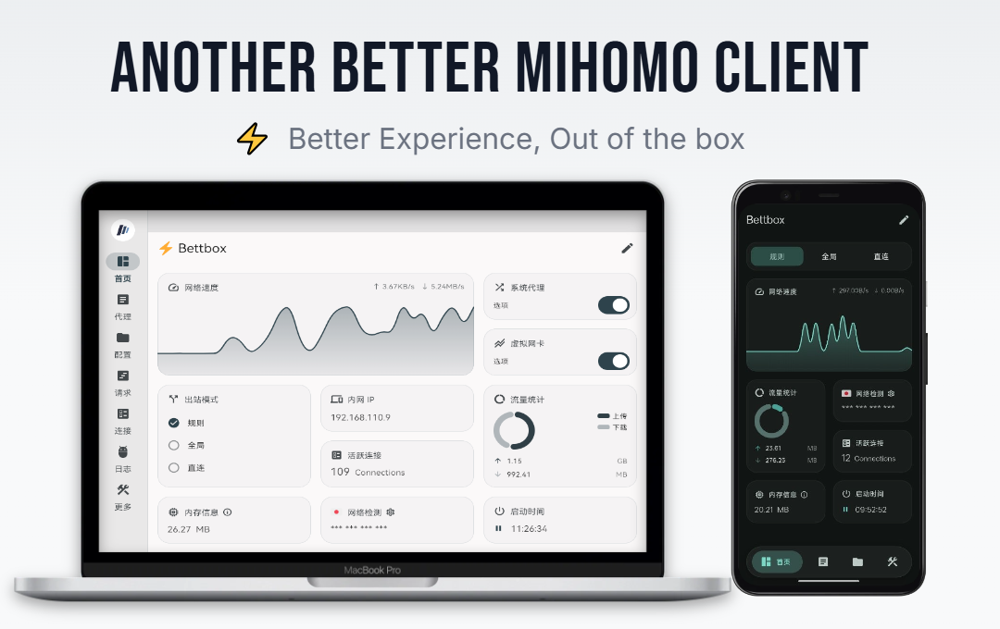

  <a href="README.md">简体中文</a> | <strong>English</strong>

<h1 align="center">⚡ bettbox+</h1>

  <strong>A lightweight, high-performance cross-platform proxy and rule-based routing client based on Bettbox</strong>

  
  
  
  

  

---

## 📖 Introduction

**bettbox+** is a high-performance, cross-platform network proxy and rule-based traffic routing client powered by the **Mihomo (Clash Meta)** core, rebuilt and enhanced upon the acclaimed **[Bettbox](https://github.com/appshubcc/Bettbox)** project.

Guided by the principles of lightness, fluidity, and out-of-the-box readiness, bettbox+ preserves Bettbox's signature high frame rates, sleek interface, and minimal battery consumption, while incorporating stability improvements and built-in **Chain Proxy** support for seamless multi-hop routing.

---

### ✈️ Community

👉 **Official Telegram Group**: [https://t.me/+xtB80V6DWhZmZDVl](https://t.me/+xtB80V6DWhZmZDVl)  
👉 **Official Telegram Channel**: [https://t.me/bettboxplus](https://t.me/bettboxplus)

---

## 🚀 Key Features

* **⚡ Fluid & Low Power**: Smooth 120Hz animations in foreground, intelligent sleep mode with near-zero resource consumption in background.
* **🛠️ Out-of-the-Box TUN / VPN**: Comprehensive virtual network adapter integration for both Android and Windows with zero hassle.
* **🔗 Chain Proxy Support**: Native multi-hop chaining connecting high-speed relay hops with landing proxies, shielding true client IPs.
* **📊 Dashboard & Widgets**: Sleek home screen and desktop widgets for real-time throughput and connection monitoring.
* **💻 Built-in Code Editor**: Powerful refactored code-forge editor for tweaking complex configurations.
* **🔒 Clean & Transparent**: Open-source, ad-free, zero tracking, dedicated strictly to proxy performance.
* **📱 Side-by-Side Coexistence**: Android package `com.appshub.bettbox.plus` with launcher label `bettbox+`, installable alongside original Bettbox.

---

## 🔗 Chain Proxy at a Glance

bettbox+ includes native, easy-to-use **Chain Proxy** (two-hop proxying):
- **How It Works**: Traffic routes through an initial high-speed relay hop before reaching the egress landing node (e.g. residential or self-hosted proxy), combining high speed with pure identity.
- **Easy Import**: Supports batch multi-line paste across diverse proxy formats and standard URIs.
- **Loop-Free Isolation**: Dedicated hop pool isolation prevents circular reference deadlocks with instant mode switching.

---

## 🛡️ WARP on Proxy (Cloudflare WireGuard Egress)

bettbox+ supports cascading an egress Cloudflare WARP tunnel over airport proxies:
- **Prevent Google Redirection**: Route through airport nodes into Cloudflare's WireGuard Anycast network to resolve CAPTCHAs and geolocational redirects.
- **Pure Identity & Privacy**: Conceal the airport landing IP behind Cloudflare's Anycast IP to unlock OpenAI/ChatGPT, Claude, Gemini, and streaming services.
- **Visual Diagnostics**: Real-time trace validation testing `warp=on`/`warp=plus`, egress IP, edge POP colo codes (HKG, NRT, SJC...), and anti-redirect scores.

---

## ⬇️ Download & Installation

Please visit the **[Latest Releases](https://github.com/Tiam9173/bettboxplus/releases/latest)** to download:

| Platform | Package | Description |
| :--- | :--- | :--- |
| **Android 8.0+** | [`bettbox+-1.19.2-android-arm64-v8a-coexistence.apk`](https://github.com/Tiam9173/bettboxplus/releases/latest) | Coexistence build, desktop display name `bettbox+`, TUN supported |
| **Windows 10 / 11** | [`bettbox+-1.19.2-windows-amd64-portable.zip`](https://github.com/Tiam9173/bettboxplus/releases/latest) | Green portable archive, double-click `bettbox+.exe` to run |

---

## 💖 Acknowledgements

- **[Bettbox](https://github.com/appshubcc/Bettbox)**: Our highest gratitude to the Bettbox project for providing an exceptional foundation.
- **[FlClash](https://github.com/chen08209/FlClash)**: For the outstanding GUI design and Flutter architecture.
- **[Mihomo (Clash.Meta)](https://github.com/MetaCubeX/mihomo)**: For the powerful and flexible routing core.

---

## 📄 License

This project is licensed under the **GPL-3.0 License**.
