  <a href="README.md">简体中文</a> | <strong>English</strong>

<h1 align="center">⚡ bettbox+ (Bettbox Plus)</h1>

  <strong>Next-Generation Multi-Platform Proxy Client with Native Chain Proxy & Residential IP Engine</strong>

  
  
  

  

---

## 📖 Introduction

**bettbox+** is a high-performance cross-platform network proxy and rule-based routing client based on the **Mihomo (Clash Meta)** core, rebuilt and enhanced upon the acclaimed **[Bettbox](https://github.com/appshubcc/Bettbox)** project.

bettbox+ is crafted specifically to address the demanding needs of cross-border operations, global social media (TikTok, Instagram, WhatsApp, X), overseas e-commerce account separation (Amazon, eBay, Shopee), AI productivity (ChatGPT, Claude, Gemini, Midjourney), and privacy-conscious users. While preserving Bettbox's signature high frame rates, sleek user interface, and minimal battery consumption, **bettbox+ introduces an innovative out-of-the-box Chain Proxy & Residential IP Engine**. This engine seamlessly chains high-speed proxy hops with overseas static residential IPs, delivering optimal throughput alongside genuine residential identity.

---

### ✈️ Telegram Channel & Community

Join our official channel for announcements, updates, and best practice guides:

👉 **Telegram Channel**: [https://t.me/bettboxplus](https://t.me/bettboxplus)

---

## 🌟 Key Highlight: Chain Proxy & Residential IP Engine

Proxy chaining (multi-hop proxy) is the defining capability of bettbox+:

```mermaid
flowchart LR
    User["Local Device / Browser / App"] -->|"TUN Virtual Adapter / Local Port"| Core["bettbox+ (Mihomo Core)"]
    Core -->|"Hop 1: High-Speed Line (BGP/IEPL Tunnel)"| Hop["✈️ 链式跳板 (Fast Airport Node)"]
    Hop -->|"Hop 2: Overseas Egress"| Residential["🔗 Landing Node (Static Residential IP)"]
    Residential -->|"Residential Broadband Identity"| Target["Target Service (TikTok / Google / OpenAI / Amazon)"]
```

### Why Use Chain Proxy?
- **Drawbacks of Plain Datacenter Nodes**: Datacenter IPs are frequently flagged or banned by risk control algorithms.
- **Drawbacks of Direct Residential Connections**: Overseas residential nodes suffer high latency, packet loss, or unreachable connections when accessed directly from mainland networks.
- **The bettbox+ Solution**: Uses high-speed airport relay tunnels to reach the overseas hop, which then routes locally to the residential IP. You get both airport-grade high-speed bandwidth and 100% pure residential IP legitimacy!

### Six Core Technical Innovations:
1. **Intelligent Batch Parsing**:
   - Supports proxy formats: `IP:Port:User:Pass`, `User:Pass@IP:Port`, and whitelist `IP:Port`.
   - Supports standard URIs: `socks5://`, `http://`, `ss://`, `trojan://`, `vless://`, `vmess://` with `#` tags for node aliases.
   - Mixed multi-line pasting with automatic comment/empty-line filtering.
2. **Dedicated Hop Pool Isolation (`✈️ 链式跳板`)**:
   - Automatically provisions a dedicated hop selector group in Mihomo core to cleanly decouple airport outbound nodes from landing proxies.
   - Filters out non-proxy informational nodes (traffic balance, expiration notices) and prioritizes real proxies as first hops.
   - Prevents circular self-referencing deadlocks entirely.
3. **WebRTC Real IP Leak Defense**:
   - Automatically injects strict STUN/TURN protocol interception rules (ports 3478, 19302, etc. and known STUN domains) to shield your true public/local IP from browser JavaScript inspection.
4. **Throughput & Concurrency Optimization**:
   - Fine-tuned network stack parameters: `tcp-concurrent`, `unified-delay`, Keep-Alive connection persistence, and automatic ALPN `[h2, http/1.1]` negotiation for HTTP TLS proxies.
5. **Robust Dual-Mode Compatibility & DNS Loop Prevention**:
   - Seamless instant switching across both Rule Mode and Global Mode.
   - Dedicated bootstrap DNS routing and `fake-ip-filter` safeguards against DNS deadlocks between hops.
6. **Multi-Target Independent Health Checks**:
   - Real-time millisecond latency probing for Cloudflare, OpenAI, TikTok, YouTube, and more.

---

## 🚀 Key Features

* **High Frame Rate & Energy Efficiency**: Smooth 120Hz UI animations with minimal idle resource consumption.
* **Out-of-the-Box TUN / VPN**: Comprehensive virtual network adapter integration for both Android and Windows.
* **Side-by-Side Coexistence**: Android package `com.appshub.bettbox.plus` with launcher label `bettbox+`, and standalone Windows portable package, supporting side-by-side installation with upstream Bettbox.
* **Built-in Code Forge Editor**: Powerful in-app editor for advanced configuration tweaking.
* **Desktop & Mobile Widgets**: Monitor real-time throughput and outbound modes directly from the home screen.
* **Zero Privacy Risk**: Fully open-source, no ads, zero telemetry.

---

## 🛠️ Download & Installation

Please visit the **[Latest Releases](https://github.com/Tiam9173/bettboxplus/releases/latest)** to download:

* **Android 8.0+**:
  - `bettbox+-1.19.2-android-arm64-v8a-coexistence.apk` (Desktop launcher displays as `bettbox+`, coexistence package, supports TUN virtual network card)
* **Windows 10 / 11**:
  - `bettbox+-1.19.2-windows-amd64-portable.zip` (Green portable archive, extract and double-click `bettbox+.exe` to run)

---

## 💖 Acknowledgements

bettbox+ is built upon the extraordinary foundation of open-source projects:

* **[Bettbox](https://github.com/appshubcc/Bettbox)**: Our highest gratitude to the Bettbox project for the exceptional foundation.
* **[FlClash](https://github.com/chen08209/FlClash)**: For the outstanding GUI design and Flutter architecture.
* **[Mihomo (Clash.Meta)](https://github.com/MetaCubeX/mihomo)**: For the powerful and flexible routing core.
* **[ClashMetaForAndroid](https://github.com/MetaCubeX/ClashMetaForAndroid)**, **[sing-box](https://github.com/SagerNet/sing-box)**, and the entire open-source network freedom community.

---

## 📄 License

This project is licensed under the **GPL-3.0 License**.
